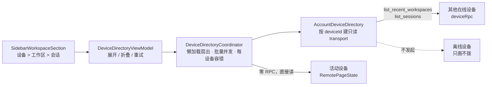

# HarmonyOS 侧栏跨设备工作区设计

Date: 2026-08-18

Scope: `src/apps/mobile/harmonyos`。不改 relay、桌面端、CLI 和
`src/crates/services/services-integrations/src/remote_connect.rs` 的远程命令合同。

## 实施状态

截至 2026-08-18：五阶段代码已接到侧栏两个宿主与冷启动回填；`harmony:architecture`、
`assembleHap`、LocalTest、`theme:color-audit:all`（浅色深色）全部通过，并已装到真机
`5ZU0226202001116`。「验证要求」里的六项真机手测在两台在线桌面上全部走过并通过。

2026-08-25 补齐二维码与账号设备的统一投影：二维码目标也固定画设备头；目标 `deviceId`
已在账号目录时复用该真实设备行，不在目录时作为临时设备置顶，同时保留账号下其他电脑。
鸿蒙仍是单活动控制目标，这次只统一导航树，不改变传输拓扑。

第 4 项（跨设备打开会话）第一次跑是失败的，成因和修法记在这里，因为它牵出的是一处传输层
缺陷而不是 UI 疏漏：目标桌面不应答时，`AccountDeviceCommandTransport.send` 把调用方给的
timeout 整个丢掉，一律吃 `deviceRpc` 写死的 130 秒，于是一次失败的设备切换要挂满两分钟，
其间既没有等待态、失败后也没有把控制目标退回原设备。三处修完：timeout 从
`AccountDeviceCommandTransport` 一路传到 `deviceRpc`；`connectAccountDevice` 的握手单独用
`ACCOUNT_HANDSHAKE_TIMEOUT_MS = 15000`（握手的沉默意味着桌面没了，不是桌面忙）；
`RemoteCreateFlowController.ensureRemoteControlTarget` 在切换点弹一次
`remote.settings.deviceSwitching` 吐司，`SettingsController` 在切换失败后调
`restoreControlTarget()` 回到切换前那台（`restorableControlTarget()` 必须在 teardown
清空状态**之前**取快照）。复验用 `kill -STOP` 冻住 Mac 桌面制造「relay 仍报在线、桌面不
应答」这一模一样的条件：T+4 s 屏上是「正在恢复连接 · 正在连接」，T+16 s 头部退回原设备。
日志的三行时间戳对得上——`device rpc cmd=get_workspace_info` 15:33:32.534、
`account device handshake failed … Operation timeout` 15:33:47.547（15.0 秒，不是 130）、
`control target restored device=3fa42461…` 15:33:48.576。

第 5 项（在第二台新建会话不搬动那台桌面的工作区）在真机上验了，通过，四条证据互相独立：
桌面日志只有 `Session created`，没有任何 `open_workspace`；`workspace_data.json` 虽在同一秒
被改写，但 `current_workspace_id` 内容没变（**看内容不看 mtime**，只看 mtime 会误判成失败）；
新会话落在被点的那个工作区目录下，说明测试不是空转；手机侧 `get_workspace_info` →
`create_session` 全程 0.5 秒，中间没有 `set_workspace`。

同一轮真机验证暴露并已修的是在线判定，共三处：relay 的 presence 会谎报离线、宽屏根本不刷新
presence（见「4. 拉取策略」后两条），以及 `ForEach` 键撞车导致活动设备那一行永远渲染摊平占位
对象（见「3. 每台设备一个组件实例」末段）。第三处才是「明明连着却灰着」的直接原因——前两处修完，
模型里 `online` 已经是 `true`，画面照旧是灰的。冷启动复验：活动桌面亮起并默认展开，列出自己的
工作区与会话。

## 背景

手机端今天是"多设备可切换，单设备活动"：整个远控界面在任意时刻只面向一台桌面。侧栏的
工作区分区因此只能展示**当前那一台**机器的工作区；想看另一台上的东西，必须先把全局控制
目标切过去，切过去之后前一台就从视野里消失了。

这不是中控。中控的最低要求是：**账号下所有桌面上的工作区和会话，同时可见。**

导航面本身已经具备承载这件事的形状。`dd0d89dfe` 把侧栏从"先选来源（本地 / Remote）再看
内容"的分段选择器，重构成了一条统一的滚动流——上半是会话时间线，下半是工作区分区，工作
区分区由宿主通过 `@BuilderParam` 注入，侧栏本身不认识远程状态。`107cac595` 又把"连接电脑"
这一行从 `AppRoute.RemoteHome` 改接到连接面板上，因为那个路由的宽屏详情面只是一块没有任何
控件的占位。

所以本设计不新增页面。**多设备这一层长在既有的 `SidebarWorkspaceSection` 上**：设备成为
工作区之上的一层分组。分区标题一律为「设备」；账号设备和二维码配对都画设备头，优先使用
`listDevices` 的真名，不用「未连接」这种连接状态顶替设备名。二维码目标按 `deviceId` 与账号
目录合并；目录里没有它时保留为临时设备行。离线设备默认收成灰行，缓存只在用户展开后出现。

## 目标

- 侧栏工作区分区呈现账号下**所有**桌面设备的工作区与会话，层级为「设备 > 工作区 > 会话」。
- 展开一层只预览 3 条：点开设备不列出全量工作区，点开工作区不列出全量会话；「还有 N 个」每次再展开 3 条，不一次铺开。
- 浏览另一台设备的内容不需要任何显式的"切换控制设备"动作。
- 浏览和创建都不改变被观察那台桌面自己正在打开的工作区。
- 账号桌面与二维码桌面都画设备头；同 `deviceId` 合并，异 `deviceId` 并存。

## 非目标

- **不做跨设备运行状态**。见下表：远端会话列表协议不携带执行状态，做"运行中 / 待授权 /
  失败"必须先改后端。会话行的绿点继续只表示**当前活动设备**正在跑的那一轮，因为那是手机
  唯一真知道的事。
- **本轮不做 Detached Dispatch**，它需要新增跨端命令族，超出这份文档「不改远程命令合同」
  的范围。手机怎么从中控位置上把一台机器的活派到另一台去，见
  [`mobile-detached-dispatch-design.md`](mobile-detached-dispatch-design.md)。
- **不做多设备并发对话**。对话面仍然一次一台：点开另一台的会话时自动切换控制目标，切换
  是隐式的，但仍然是切换。
- 不改 relay、不改桌面/Android/iOS、不新增或放宽任何远程命令。

## 已核实的基线事实

这一节是后续裁决的依据，每条都对应可复查的代码位置，按当前 `main` 核对。

| 事实 | 依据 | 对设计的影响 |
|---|---|---|
| 账号设备传输已经是无状态、按设备寻址的一次性加密 HTTPS RPC | `services/CloudAccountClient.ets:264` `deviceRpc(relayUrl, session, targetDeviceId, command)` | 跨设备并行观察不需要新传输，也不需要 relay 改动 |
| 账号设备"连接"没有服务端状态，只是构造 transport 后发两条 RPC | `services/RemoteSessionManager.ets:115` `connectAccountDevice` | "连接一台设备"是 UI 概念，不是资源占用 |
| 单设备约束落在一个字段上 | `services/RemoteSessionManager.ets:33` `private transport?` | 解除单活动设备是手机端重构，不是协议问题 |
| 全局只有一个控制目标 | `pages/state/RemotePageState.ets:30` `controlTargetDeviceId` | 该字段的语义要收窄为"我正在对话的那台"，而不是"手机现在归谁" |
| 切换设备会停轮询、清空 workspace / session / timeline 再连新设备 | `pages/viewmodel/SettingsController.ets:426` `selectCloudAccountDevice` | 跨设备打开会话可直接复用它，不需要新写连接逻辑 |
| 设备列表已携带在线状态 | `services/CloudAccountClient.ets:247` `listDevices`，`:259` 逐台带出 `online` | 离线设备可以只画不拨，避免一串 130s 超时 |
| 跨工作区扇出已存在，并已做并发上限 | `services/ConcurrentWorkspaceListing.ets:14` `CONCURRENT_WORKSPACE_LISTINGS = 4`、`services/RemoteWorkspaceCoordinator.ets:41` `sessionsForWorkspaces` | 加设备维度是复用这套批量语义，不是新写扇出 |
| 会话列表和聊天记录的本地库已按 `device_key` 分区 | `services/RemoteSessionListRdbStore.ets:26`、`services/RemoteChatLocalRdbStore.ets:30` | 多设备缓存不需要迁移主键，今天只是从没写过第二行 |
| `CreateSession` 直接绑定入参 `workspace_path`，不依赖宿主活动工作区 | `remote_connect.rs:1295` 的 `binding_workspace` | 手机建会话时的 `set_workspace` 是手机端遗留，可以去掉 |
| 手机建会话会先切换宿主活动工作区（本轮已修，此行记录改前基线） | 改前 `pages/viewmodel/RemoteSessionViewModel.ets` 的 `createSessionInWorkspace` 调 `onSelectWorkspace`；修后见 `:147`，该分支已删除（`316f66d5b`） | 会打扰坐在那台机器前的人，中控前必须先修 |
| 新建流程里"选设备"实际是切换全局控制目标，且提交时要求所选设备等于当前活动设备 | `pages/viewmodel/RemoteCreateFlowController.ets:186`、`:211` | 设备选择被当成了主导航，这正是要消除的 |
| 远端会话摘要不含执行状态 | `remote_connect.rs:1827` `SessionInfo` 无 status 字段；`services/RemoteResponseMapper.ets:67` 因此一律填 `'idle'` | 跨设备"在跑什么"做不了，必须先改后端，本轮排除 |
| `ListSessions` 强制要求非空 `workspace_path` | `remote_connect.rs:1252` | 没有设备级列表，只能按工作区扇出 |
| 侧栏会话投影缓存是**单槽**的 | `pages/policy/SessionListProjection.ets:304` | 一个实例服务多台设备会每次 rebuild 都 miss，必须一设备一实例 |
| 工作区分区由宿主注入，侧栏不认识远程状态 | `pages/components/AppSidebar.ets:56` `@BuilderParam contentSlot` | 加设备层不会把远程状态漏进 `AppSidebar` |
| 同一个工作区分区被两个宿主复用 | `pages/components/AppRootOverlaySurfaces.ets:58`、`pages/components/WideConversationHost.ets:184` | 改参数必须两处同步，窄屏和宽屏语义一致 |

## 设计

### 1. 观察面按设备扇出，对话面仍单设备

关键事实是 `deviceRpc` 本来就是无状态的：每次调用自带 relayUrl、账号 session 和目标
deviceId，直接 POST 到 `/api/devices/{id}/rpc`。今天的跨工作区扇出之所以要经过
`RemoteSessionManager`，只是因为它恰好握着那唯一一个 transport，而不是因为列工作区、列会话
需要连接状态。

因此**不动** `RemoteSessionManager` 的单 transport 模型。它同时拥有 `this.workspace`、轮询
和聊天，把它改成 transport 表会让一条读路径的改动波及所有写路径。取而代之，新增一个只读的
目录服务，按设备现场构造 `AccountDeviceCommandTransport`，只发两条只读命令
（`list_recent_workspaces`、`list_sessions`），与活动连接完全隔离。



分工上，**活动设备**那一组的数据仍旧来自 `RemotePageState`（它已经加载好了，且要跟着轮询
实时更新），目录服务只负责其余设备。这样活动设备不会出现两份互相打架的副本。

### 2. 分层

| 文件 | 动作 | 职责 |
|---|---|---|
| `services/AccountDeviceDirectory.ets` | 新增 | 按 deviceId 建只读 transport，只发 `list_recent_workspaces` / `list_assistants` / `list_sessions` |
| `services/DeviceDirectoryCoordinator.ets` | 新增 | 懒加载扇出、批量并发、每设备与每工作区各自容错 |
| `pages/state/DeviceDirectoryState.ets` | 新增 | `@ObservedV2`，与 `RemotePageState` 并列的目录快照 |
| `pages/viewmodel/DeviceDirectoryViewModel.ets` | 新增 | 展开 / 折叠 / 重试意图 |
| `pages/components/SidebarDeviceGroup.ets` | 新增 | 一台设备一个组件实例 |
| `pages/components/SidebarWorkspaceSection.ets` | 改 | 顶层从工作区列表变为设备列表 |

`RemotePageState` 的语义**不变**：它继续表示"我现在正在对话的那台设备"。目录是另一个状态
对象，而不是往一个 per-active-device 的类里塞 per-device 缓存——那会让每个既有字段都要重新
回答"这是哪台机器的"。

### 3. 每台设备一个组件实例

`SessionListProjectionCache`（`pages/policy/SessionListProjection.ets:304`）是**单槽**缓存：
它只记得上一次的标量键与两个数组的引用/指纹，命中才返回同一个投影实例。而标量键里就含
`workspacePath` / `workspaceName`，所以一个实例轮流服务多台设备必然每次都 miss，退回全量
`SessionListProjector.project()`。按它自己的注释，这个缓存存在的理由正是让"选中一个会话"
这种不改输入的重建退化成属性 diff，而不是重算整棵列表。

所以把设备组抽成 `SidebarDeviceGroup` 这个 `@ComponentV2`，每个实例持有自己的
`projectionCache`，天然做到一设备一缓存。`WorkspaceGroup` / `SessionRow` / `MoreSessionsRow`
三个 `@Builder` 从 `SidebarWorkspaceSection` 原样平移进来，逻辑不变，只多一级缩进。

**`ForEach` 的键必须区分临时设备行**。`ForEach` 把子组件绑定在它**首次创建时**的那个 item 上，
只有键变了才会重新读 item。二维码刚连上而账号目录尚未返回时使用 `transientEntry`；它带的正是
控制目标自己的 deviceId，所以无前缀会与稍后落地的真实设备行撞键。`deviceKey()` 给临时行加
`transient:` 前缀；同一设备进入账号目录后键发生变化，子组件才能重建到账号持有的可观察对象上。
注意这类失效只发生在 **`ForEach` 里实例化的子组件**上；`@Builder` 渲染的行随父组件重建，
不受影响。

`SidebarWorkspaceSection` 退化为"设备列表 + 分区头"。所有桌面都画设备头；账号目录是基础列表，
活动控制目标不在目录时作为临时设备置顶，在目录中时直接复用真实行。这样账号状态与二维码通道
可以并存，但同一台电脑不会重复出现，用户也始终能看见工作区属于哪台机器。

### 4. 拉取策略：展开才拉，离线不拨

- 离线设备默认只画一个带真名的灰行，永不发 RPC。`deviceRpc` 的读超时是 130 秒
  （`CloudAccountClient.ets:291`），一台离线机器就足以让整个分区看起来是坏的。
- **活动设备**默认展开，数据来自 `RemotePageState`，零额外 RPC。
- 在线状态本身也要刷新，而且**不能只靠事件驱动**。设备列表过去只在冷启动拉一次，于是启动
  之后才上线的桌面会一直灰着，直到 app 被杀掉重启。回到前台与打开侧栏各触发一次
  `refreshAccountDevicesIfStale`（15 秒内的答案视为仍然新鲜——够短，让一台刚上线的桌面在同一
  次使用里就变亮；够长，让冷启动时同时发生的两个事件只花一次请求）。但「打开侧栏」这个事件
  只存在于窄屏：宽屏把 `AppSidebar` 常驻在 `WideConversationHost` 的主栏里，`openAppSidebar`
  永远不会触发，于是最需要它的那块屏反而一次都不刷新。relay 也没有推送 presence 的通道。
  因此另加一个前台轮询 `SettingsController.startPresencePolling()`（`PRESENCE_POLL_INTERVAL_MS`
  = 20 秒一拍，复用 `RemoteHeartbeatController` 的丢重叠语义），由 `AppRootRuntime` 的
  `onPageShow` 起、`onPageHide` / `aboutToDisappear` 停——页面不在屏上就没有东西会过期。
  轮询器放在 `SettingsController` 而不是 `AppRootRuntime`：presence 的其余部分本来就归它，
  而 `AppRootRuntime` 只剩 5 行预算（上限 500），把定时器塞进去会顶破架构检查。
- **有活链路时不听 relay 的**。relay 的 `online` 是内存连接注册表的投影
  （`relay-service/src/db.rs:251`），会滞后、也会丢条目：真机上出现过 `/api/devices` 报
  `online=false`，而同一台桌面每 15 秒的 `cmd=ping` 都返回 200。手机对「我正连着的那台」有
  第一手证据，所以 `syncDevices` 里活链路压过 relay 的答案。这条规则求值于**列表被发布的那
  一刻**，因此链路刚变活时必须重新发布一次（`SettingsController.resyncAccountDevicePresence()`，
  不发请求，只是把缓存的同一份列表再读一遍）——冷启动的设备列表往往先于重连落地，那一次拉回
  来的答案正是「离线」。发布点唯一，视图层不复制这条规则，否则两处会各自腐烂。
- 其他在线设备默认折叠。首次展开触发 `list_recent_workspaces` + `list_assistants`，再对该
  设备的工作区路径批量 `list_sessions`。磁盘回填是 `cached`：先画出来，展开后仍要被 RPC
  覆盖，不能把缓存当成已经加载完。
- 数据可以一次拉全，画面不能一次铺开。点开设备只预览 3 个工作区（工作区行默认收起），
  点开工作区只预览 3 条会话；「还有 N 个」每次再展开 3 条。活动设备默认展开。
  磁盘缓存仍存该设备的完整工作区/会话快照，不按预览窗口裁切；「还有 N 个」和继续展开
  都靠这份全量，预览游标只活在组件 `@Local` 里，冷启动回到第一批 3 条。
- 批量并发复用 `RemoteWorkspaceCoordinator` 已有的形状（一次 4 个，按给定顺序合并，因此
  调宽批量只改耗时不改结果）。把那段循环提成共享 helper 由两边调用，而不是复制一份。
- 容错分两级，与既有实现一致：一个工作区读不出来只丢那一个工作区（既有注释：一个读不了的
  工作区不构成丢掉另外二十个的理由）；整台设备失败只把该设备标为 `failed` 并给一行重试，
  不影响其余设备。**失败必须可见**——设备从聚合结果里静默消失，比报错更糟。

### 5. 打开另一台设备上的会话

`RemoteSession` 增加可选字段 `deviceId?`，由目录协调器在映射之后盖章，`RemoteResponseMapper`
不用改（它映射的是线上报文，而设备身份是调用方才知道的事）。侧栏的打开动作变为：会话属于
非活动设备时，先复用 `selectCloudAccountDevice` 完成整套连接与状态置换，再打开会话；
`navigateHome` 传 `false`，因为路由由打开会话本身负责。

这条边界要在文案上说清楚：**看是多设备的，聊是单设备的**。点开另一台机器上的会话会把手机
的对话通道移过去，这是真实发生的事，不能假装没有。

切换要有始有终，两头都要有交代。**开头**：`ensureRemoteControlTarget` 是唯一的切换缝
（打开会话与工作区内新建都走它），在那里弹一次 `remote.settings.deviceSwitching`，否则
用户面对的是一段没有任何解释的静止界面。**结尾**：切换失败必须回到切换前那台，而不是把
手机留在一个既没连上新设备、也不再轮询旧设备的悬空态。快照要在 teardown 清状态之前取
（`restorableControlTarget()`），恢复本身带一个 `restoringControlTarget` 重入位——要恢复
的那台也死了时不能来回互拨；恢复也不关用户自己打开的面板，只有用户主动选设备的那条路径
才走 `navigateHome`。

**握手的超时必须自己给**。`AccountDeviceCommandTransport` 过去把调用方的 timeout 丢了，
一律用 `deviceRpc` 的 130 秒；那是给「桌面在唤醒冷进程」留的耐心，不该套在握手上——握手
沉默说明桌面不在了。所以 `connectAccountDevice` 的第一条 `get_workspace_info` 用
`ACCOUNT_HANDSHAKE_TIMEOUT_MS = 15000`，失败经 `handshakeFailure()` 归一成
`remote.settings.deviceUnavailable`，原始报文只进日志。这条尤其容易复发：relay 的
`online` 在桌面进程被冻住时仍然报 `true`（socket 没断），所以「设备在线」永远不能当成
「设备会应答」的保证。

`AppRootRuntimeComposition` 中按 `item.id` 去重的两处要改成按 `deviceId + id` 去重——不同机器
上的会话 id 理论上可以撞，撞上时静默丢一条是最难查的那类 bug。

### 6. 持久化

会话列表的本地表已经是 `device_key TEXT PRIMARY KEY`，存 N 行不需要改主键。需要新增的只有
工作区快照：

```sql
CREATE TABLE IF NOT EXISTS remote_device_workspaces (
  device_key TEXT PRIMARY KEY, payload TEXT NOT NULL, updated_at INTEGER NOT NULL)
```

并把 `RemoteSessionListRdbStore` 的 `SCHEMA_VERSION` 从 1 提到 2。缓存按定义可重建，提版本
会丢掉旧的 `remote_session_list`——这正是那个常量注释所说的用法，代价是一次冷启动多拉一遍。

冷启动时按已知设备逐个回填，让展开过的设备先显示缓存、再被 RPC 覆盖。缓存回填把
状态标成 `cached`，不是 `ready`：`ready` 只表示这一轮 RPC 已经结束。浏览另一台桌面
时走 `saveObservedList`，**不得**改写 `last_device_key`——那个指针只属于当前控制目标，
冷启动 `restoreLast()` 必须和自动重连瞄准同一台机器。

切换控制目标前，必须在 teardown 清空 live 列表之前把当前工作区/会话快照写进该设备的
目录行（`captureLive`）；空列表不能覆盖已有快照。活动设备的目录行不再被标成
`ready` + 空数组，否则它一旦不再活动就会永远跳过拉取。

## 前置修复：创建会话不该改动宿主的活动工作区

`createSessionInWorkspace` 在目标工作区与当前工作区不同时，会先 `onSelectWorkspace(path)`，
也就是**手机改掉了那台桌面正在打开的工作区**。而 `CreateSession` 本来就直接绑定入参
`workspace_path`，这次 `set_workspace` 是多余的。

单设备下这只是有点粗鲁；多设备中控下它是错的——在 B 机器上开个会话不该把 B 的界面挪走。

修法：`CreateSessionOptions` 增加 `workspacePath?`；`RemoteSessionManager.createSession` 用
`options.workspacePath` 兜底到当前工作区（`RemoteCommandFactory.createSession` 本来就收路径
参数，不用改）；`createSessionInWorkspace` 删掉切换工作区的分支及其后的
`workspacePath === path` 守卫，失败恢复路径相应简化。

这一步独立可验收，先做。

## 阶段划分

**阶段一：前置修复。** 创建不搬工作区。改动三个文件，独立验收。

**阶段二：目录服务与状态。** `AccountDeviceDirectory`、`DeviceDirectoryCoordinator`、
`DeviceDirectoryState`、`DeviceDirectoryViewModel`；抽出共享的批量 helper；
`RemoteSession.deviceId`。此阶段无 UI 变化，由单元测试覆盖。

**阶段三：侧栏设备层。** 抽出 `SidebarDeviceGroup`；`SidebarWorkspaceSection` 顶层改为设备
列表，账号桌面无论几台都画设备头；两个宿主同步改参数；新增设备离线、加载失败重试、"还有 N 台设备"
的文案键。

**阶段四：跨设备打开会话。** 打开前置切换；去重键改为 `deviceId + id`；工作区内新建同样带上
设备身份。

**阶段五：持久化。** 新增工作区表、`SCHEMA_VERSION` 提到 2、冷启动逐设备回填。

## 验证要求

各阶段标记完成前至少需要：

- 架构检查：`pnpm run harmony:architecture` 通过。新增文件必须守住既有边界——`services/**`
  不 import `../pages/`；`pages/components/**` 不 import `pages/viewmodel/`（设备组只吃
  `@Param` 与 `@Event`）；新组件用 `@ComponentV2`；Actions / Hooks 用具名接口加对象字面量。
- 单元测试（`entry/src/test`，LocalTest）：一台设备抛错时其余设备结果完整返回；批量 helper
  的合并顺序与批宽无关；离线设备不产生任何 RPC；`deviceId + id` 去重下两台设备的同 id 会话
  都保留。
- 构建与本地测试：

  ```bash
  source scripts/ohos-env.sh
  "$HVIGORW" --mode module -p product=default -p module=entry@default assembleHap --no-daemon
  "$HVIGORW" --mode module -p module=entry@default -p ohos.test.type=LocalTest test --no-daemon
  ```

- 真机手工验证（需要账号下至少两台桌面）：
  1. 只有一台账号桌面时仍画设备头，名称是桌面真名，不是「未连接」；
  2. 两台在线时，展开第二台能列出它的工作区与会话，第一台不受影响；
  3. 第二台离线时是灰行，不转圈、不超时；
  4. 从第二台打开一个会话，自动切换控制目标并进入会话，消息可收发；
  5. 在第二台的某个工作区新建会话，该桌面**当前打开的工作区不变**；
  6. 杀进程重启后，展开过的设备先出缓存再刷新。
- 主题：`pnpm run theme:color-audit:all`。设备行只用 `Theme.ets` 的语义色，浅色深色都要看。

## 与既有文档的关系

`wide-conversation-navigation-design.md` 的"已实现"一节仍在描述宽屏左栏的"本地 / Remote"
分段选择器。该选择器已随 `dd0d89dfe` 删除（`ConversationSource` 与 `ConversationSourceSwitcher`
一并移除，路由合同改为 `isRemoteRoute` / `remoteSurfaceDestination`）。那份文档的更新不在本轮
范围内，此处记一笔，避免下一个读者把它当作现状。
