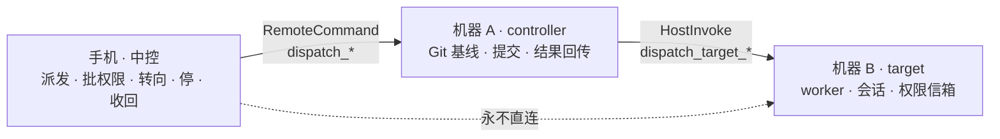

# 鸿蒙端 Detached Dispatch：手机是中控

Date: 2026-08-18

Scope: `src/apps/mobile/harmonyos`，外加为它新增的一族 `RemoteCommand`。本设计**必须**改
`src/crates/services/services-integrations/src/remote_connect.rs` 与桌面端的远程命令路由，理由见
「为什么这次躲不开后端」。不改 relay，不改 CLI 的 dispatch 目标端，不改
[`docs/architecture/detached-task-dispatch.md`](../../../../../docs/architecture/detached-task-dispatch.md)
定义的协议版本 4。

## 原则

**手机是中控。任务不在手机上执行，但手机可以控制一切。**

这条原则划的是「决定」与「干活」的界，不是「手机能做」与「手机不能做」的界。它给出本设计的
两条判据，全文每一处取舍都由它们裁定：

1. **凡是决定，手机都要能做。**派给谁、拿什么派、批不批权限、要不要停、要不要把结果收回来——
   缺一个，就是设计没做完，不是「留待后续」。
2. **凡是干活，手机一件都不做。**Git 基线工作树、bundle 传输、worker 进程、目标工作树，
   全在机器上发生。

第 2 条不是对手机的限制。手机不建 Git 基线，是因为那是干活，不是因为手机没资格。把执行的
限制写成权限的限制，会把整份设计带偏成「手机只能当只读观察者」——这是本设计最容易走错的一步，
写在最前面。

## 主用例：手机远控 A，把 A 上的活派到 B

协议原生就是这个形状：A 是 controller（它有仓库、有工作树服务），B 是 target（它有 worker
和权限信箱），**手机是下决定的那个**。三者各就各位，谁也没越界。

目标 B 可以是同账号的另一台桌面：`DispatchTargetRequest`（`service/dispatch/target.rs:50`）
有 `Device { deviceId, workspacePath }` 这一支，走账号设备 RPC，`device_controller.rs` 已经实现。
也就是说 A→B 这条路今天在桌面 UI 上就能走通，缺的只是手机上的那个决定入口。

**一处必须说清的边界**：能派出去的是「活」，不是「这个会话」。`DispatchSubmitRequest`
（`service/dispatch/controller.rs:60`）带的是 target、base_ref、`include_uncommitted`、prompt、
审批策略、模型、附件——**没有任何携带对话历史的字段**。所以：

- ✅ A 上干到一半的活，**连未提交的改动一起**（`include_uncommitted`），派给 B 接着跑；
- ❌ 手机正和 A 进行的这个会话，整个搬到 B 续上。

后者协议里根本不存在，桌面 UI 上同样搬不了，不是手机的短板。想把上下文带过去，只能由手机把
它拼进 `prompt`——那是手机在组织一段提示词，不是协议在接力会话，文档和 UI 都不许把它说成接力。

## 中控要能控什么

这张表是第 1 条判据的展开，也是本设计的验收清单。左列是决定，中列是谁去干活，右列是手机上
必须存在的入口。**右列不允许有空格。**

| 决定 | 谁执行 | 手机侧动词 | 桌面对应 |
|---|---|---|---|
| 派给哪台机器 | — | 复用侧栏设备列表 + `dispatch_probe_target` | `dispatch_api.rs:85` / `:119` |
| 拿哪个工作区的活派、带不带未提交改动 | A | `dispatch_submit`（含 `includeUncommitted`） | `:271` |
| 批一条待决权限 | target | `dispatch_answer` | `:488` |
| 给正在跑的这一轮插话 | target | `dispatch_append` | `:516` |
| 排下一轮 | target | `dispatch_continue` | `:371` |
| 停 | target | `dispatch_cancel` | `:427` |
| 把结果收回 A | A | `dispatch_sync_result` | `:338` |
| 看有哪些活、跑到哪了 | — | `dispatch_list_jobs` / `dispatch_job_status` | `:455` / `:304` / `:399` |

对照方式是逐条比 `src/apps/desktop/src/api/dispatch_api.rs` 的命令表：桌面上能做的每一个
**决定**，手机上都要有入口；桌面上剩下的那些（`dispatch_provision_target`、
`dispatch_install_cli_*`、`dispatch_sync_model_config`、`dispatch_save_transcript`）属于干活、
SSH 目标的准备工作或本机存储，手机不做，且要在「手机不执行的东西」里逐条说明为什么不做——
**不写理由的缺席等同于遗漏**。`dispatch_query` 是单个 job 的详情读取，与 status 同属观察，
合并在最后一行里。

## 为什么这次躲不开后端

前几轮的规矩是「跨端的我们不管，先完整实现鸿蒙」。那条规矩成立，是因为侧栏要的命令
`RemoteCommand` 里全都有。Dispatch 不一样：那个枚举（`remote_connect.rs:2144`）里**没有任何一个
dispatch 动词**。手机对外只有这一个通道，所以「手机能控制 dispatch」和「不改后端」不可能同时
成立——这不是取舍，是算术。

好消息是要加的很薄。桌面的 `dispatch_api.rs` 本身就是一层壳：每个命令只做「挑传输（SSH 还是
账号设备）」然后调 `service/dispatch` 里的核心函数。手机的动词打在**同一批核心函数**上，新增的
是路由，不是第二套 dispatch 实现。这是本设计成立的前提，也是它的自检线：**一旦发现要为手机
新写 job 状态机、新写存储、新写重试语义，说明设计错了，停下来重来。**

## 已核实的基线事实

| 事实 | 依据 | 对设计的影响 |
|---|---|---|
| `RemoteCommand` 里没有任何 dispatch 动词 | `remote_connect.rs:2144` | 手机要控制 dispatch，必然改这个枚举 |
| 枚举没有 `#[serde(other)]` 兜底 | 同文件全文无 `serde(other)`；解析失败见 `service/remote_connect/remote_server.rs:331` | 老桌面只会回 `parse command: unknown variant`，与「参数拼错了」不可区分——能力协商必须另走一条路 |
| 目标可以是同账号的另一台桌面 | `service/dispatch/target.rs:50` `DispatchTargetRequest::Device` | A→B 走账号设备 RPC，今天就能跑 |
| 提交请求不携带对话历史 | `service/dispatch/controller.rs:60` `DispatchSubmitRequest` 全字段 | 能派「活」，不能接力「会话」；上下文只能进 prompt |
| job 本身是多轮会话 | 规范 Conversation model：`append` steer 当前轮，`continue` 排下一轮，worker 恢复目标会话 | 派出去不是一锤子买卖，手机要能持续插话 |
| 结果回传是 controller 侧的 Git 快进 | 规范 Synchronization semantics 第 4 步：fetch 后 `--ff-only` 推进基线工作树 | 手机能**下令**同步，同步本身在 A 上发生；用户的 checkout 永不被改 |
| 桌面 dispatch API 是薄层 | `dispatch_api.rs:271` / `:338` / `:455` / `:488` 等各自只做传输选择后调核心函数 | 手机动词复用同一批核心函数 |
| 出站记录只存在 controller 本机 | `service/dispatch/mod.rs:93` `OutboundDispatchRecord`，落盘于 `~/.bitfun/dispatch/outbound/` | 手机问 A，列到的是 **A 派出去的** job，不是账号级全集 |
| 账号设备通道上 `dispatch_target_*` 是保留名 | 规范 Protocol：这些名字先于 Peer Host 桥直接路由到 target CLI | 手机的动词不能用这个前缀 |
| 光标每观察者独立，target 无 controller 租约 | 规范 Event and observer contract | 手机与桌面可同时观察同一个 job，互不干扰 |
| 光标不能单独还原画面 | 同上：光标只记录读到哪，不记录画了什么 | 投影 + 光标 + 完整性事实必须原子地写在一起 |
| 权限回复与追加消息是 target 侧幂等信箱 | 规范 Approval and supervision | 手机批与桌面批不冲突，重试安全 |
| relay 不排队 job | 规范 Failure rules 第一条 | 目标离线就是提交失败，手机不做假排队 |
| 工作区交付是 Git-only | 规范 Workspace delivery；非 UI 调用方由 controller 再校验一次 | 非 Git 工作区在手机上就要禁掉派发入口，并说明原因 |

## 设计

### 1. 派发：手机选，A 做

`dispatch_submit` 的语义是「**你**（A）以 controller 身份，在**你**的这个工作区上，向这个目标
提交一个 job」。手机提供的全是决定：目标、工作区路径、提示词、审批策略、要不要带未提交改动、
模型与附件。Git 基线、bundle、worker，一件都不经过手机。

这正好接上已经做完的侧栏：「设备 > 工作区 > 会话」让手机能看见每台桌面上的每个工作区，派发需要
的两个坐标（哪台机器出活、哪台机器干活）在侧栏里本来就是选好的。入口就长在工作区行上。

**失败必须直说。**relay 不排队 job，目标离线就是提交失败，不存在「先收下，回头替你发」。响应
丢失时 job 处于 `submission_unknown`，靠 status 或幂等重试与 target 的持久事实对账——手机不得
自己猜一个状态填上去。非 Git 工作区不给派发入口，并明写原因，而不是让它点下去再报错。

### 2. 命令族叫 `dispatch_*`，不叫 `dispatch_target_*`

新动词全部落在**桌面的 controller 角色**上，前缀必须是 `dispatch_`。`dispatch_target_*` 在账号
设备传输上是保留名，规范写明它们**先于** Peer Host 桥直接路由到 target CLI——手机若用那个前缀，
请求会被送到 target 角色，而手机要说话的对象是 controller。

这个错不会立刻炸：A 和 B 常常是同一类机器，甚至同一台，所以它会一直看起来是对的，直到某天
目标是第三台机器才现形。这是本设计里最容易写错、最难查的一处，名字必须一眼可辨。

### 3. 能力协商：老桌面必须能被认出来

枚举没有兜底分支，一台没升级的 A 收到 `dispatch_submit` 只会回 `parse command: unknown variant`，
这串字符和「手机把参数拼错了」长得一模一样。靠它判断对面支不支持，结果就是把某天的真 bug
常年显示成「该桌面版本较低」。

**能力要搭在一条老桌面本来就会答的响应上。**`get_workspace_info` 是账号设备连接的第一条命令，
给它的响应加一个可选能力数组：老桌面不认识这个字段、压根不产出，手机读到的是缺失——**缺失即
不支持**，这是不会误判的信号。手机据此决定画不画派发入口。按 AGENTS.md 的规矩这叫 degrade
loudly：不支持就收起入口或明写不支持，绝不静默失败，更不许假装成功。

### 4. 派出去之后：批权限是手机最不可替代的那件事

`remote` 审批策略下，worker 把安全的展示 DTO 持久化，status 暴露它，`answer` 记下用户来源的
回复后执行才继续。也就是：**一个跑在 B 上的长任务卡着等人点「允许」，而那个人不在任何一台
电脑前。**这是中控原则最硬的一次兑现——决定权在人身上，人在手机上。

信箱是 target 拥有的、幂等的，不依赖最初提交它的 controller，所以手机批和桌面批不冲突。手机
侧只有两条硬要求：待决权限要能推到用户眼前，不能只在打开某个页面时才被发现；待决项必须显示
**它属于哪台机器上的哪个 job**——同时看着多台机器时，一个没有出处的「允许写入文件？」是不能
批的。

### 5. 收回来：手机下令，A 执行

同步在 job 运行中和终态后都可用。target 提交自己工作树上的改动、造 `<knownHead>..<branch>` 的
增量 bundle，controller 验签后 fetch 进基线并 `--ff-only` 推进。**用户在 A 上的 checkout 永远
不被改**，基线工作树才是审阅边界。

手机在这里只出一个决定（「把结果收回来」）和一个显示（同步到了哪个分支的哪个 commit、几个文件、
有没有失败）。规范要求任一侧离开 job 分支、基线被删或有分叉提交时**可见地失败**，不做重置或
改写——手机侧同理，失败就说失败，不给「已同步」的错觉。

### 6. 光标与转录缓存：一起写，不然会撒谎

规范对观察者的要求很硬：status 要报下一个字节光标、请求的光标是否被重置、更老的历史是否被截断、
多少超大事件被省略标记替换、以及返回的转录**能否被视为完整**；轮转与超大事件绝不可被表示为
完整转录。

光标只记录读到哪、不记录画了什么，所以光标单独存不足以还原画面。**投影、产生它的光标、当时
适用的完整性事实，三者必须写在同一条记录里**——只有一起写下的这一组才自洽。落到鸿蒙端就是在
`RemoteSessionListRdbStore`（现 `SCHEMA_VERSION` = 2，`services/RemoteSessionListRdbStore.ets:15`）
加一张表，一 job 一行，整行原子写，行上带投影规则版本号；缺失、损坏、版本不匹配、超体积上限，
一律从字节 0 重放，不做修补。

被截断的历史在手机上必须**看得见**是截断的。这不是文案偏好：把省略画成完整，会让人根据一段
没发生过的历史去批一条权限。

### 7. 任务不是会话

规范要求 controller **不得**把 target 会话建进自己的正常会话库，观察记录只是 observer-only 的
路由记录。手机照办：job 不进 `remote_session_list`，不进侧栏会话时间线，不参与 `deviceId + id`
那套会话去重。它是与「设备 > 工作区 > 会话」并列的另一层，共用设备这一维，不共用会话这一维。

混进去两边都会坏：会话列表的每一行都假设自己能被打开成一个对话，而 job 不能；job 的每一行都
带着目标机器、审批策略、完整性事实，而会话行没有位置放它们。

## 手机不执行的东西

以下都不是「手机做不到」，是按原则第 2 条**不该由手机做**，且每一条的决定权仍在手机上：

- **Git 基线工作树、bundle 的制作与分块传输**——A 干。手机决定派不派、带不带未提交改动。
- **worker 进程与目标工作树**——B 干。手机决定停不停、下一轮跑什么。
- **同步时的 fetch 与 `--ff-only`**——A 干。手机决定什么时候收。
- **CLI 安装与目标 provision**（`dispatch_api.rs:138` / `:197`）——SSH 目标的准备工作，涉及签名
  校验与安装器，属于干活；账号设备目标不走这条路。手机不做，本轮也不代理。
- **向 SSH 目标同步模型配置**（`dispatch_api.rs:257`）——只对 SSH 连接成立（它取的是
  `ssh_manager`），账号设备目标没有这一步。手机的目标是账号设备，不涉及。
- **转录的本机保存**（`dispatch_save_transcript`）——那是 controller 的本地缓存实现细节，手机
  有自己的缓存表，不是同一份东西。

另有一条是协议层面的空缺，不是分工问题：**会话接力不存在**。提交请求不带历史，任何一端都搬不
了一个正在进行的会话。

## 阶段划分

按「决定的完整性」推进，不按「哪个好做」推进。

**阶段一 — 派得出去、看得见。**能力协商字段；`dispatch_submit` + `dispatch_list_jobs` +
`dispatch_job_status`；转录缓存表落地。派出去却看不到状态等于没派，所以这两件必须同一阶段交付。

**阶段二 — 管得住。**`dispatch_answer` / `dispatch_append` / `dispatch_continue` /
`dispatch_cancel`。到这一步手机开始改变别的机器上的状态，每个动词都按幂等重试来测。

**阶段三 — 收得回。**`dispatch_sync_result` 与同步结果的显示；目标选择接上
`dispatch_probe_target` 的能力检查。

三阶段做完，「中控要能控什么」那张表的右列不应再有空格。

## 验证要求

- 架构检查 `pnpm run harmony:architecture` 通过；新增文件守住既有边界（`services/**` 不 import
  `../pages/`，`pages/components/**` 不 import `pages/viewmodel/`，新组件 `@ComponentV2`）。
- Rust 侧：新动词要有 `remote_connect` 路由测试，并且**必须**有一条断言老桌面路径——没有能力
  字段时手机不发这些命令。
- 单元测试（`entry/src/test`，LocalTest）：转录缓存版本不匹配时从零重放；截断的历史不会被投影
  成完整；同一条权限回复重复提交是幂等的；离线设备不产生任何 dispatch RPC；非 Git 工作区不出现
  派发入口。
- 真机验证（账号下至少两台桌面）：
  1. 老桌面上派发入口不出现，且不产生任何失败请求；
  2. **手机远控 A，把 A 上一个工作区的活（含未提交改动）派给 B，B 上确实起了 job**；
  3. `remote` 策略下 job 卡在待决权限，**从手机批准后任务继续**，待决项显示了机器与 job；
  4. 手机 `append` 一条转向消息，B 的当前轮收到；`continue` 排出下一轮且带着上文；
  5. 从手机下令同步，结果落回 A 的基线工作树，**A 上用户自己的 checkout 未被改动**；
  6. 目标离线时派发失败并明说，本地不留任何「排队中」；
  7. 杀进程重启后，转录从缓存光标续上，截断标记仍在。
- 主题：`pnpm run theme:color-audit:all`，任务行只用 `Theme.ets` 语义色，深浅色都看。

## 与既有文档的关系

[`mobile-control-console-design.md`](mobile-control-console-design.md) 的「非目标」原本写着
「不做 Detached Dispatch」，已改为指向这里。那份文档「不改远程命令合同」的范围声明仍适用于它
自己描述的侧栏工作，不适用于本文档。

协议本体以
[`docs/architecture/detached-task-dispatch.md`](../../../../../docs/architecture/detached-task-dispatch.md)
为准。本文档不复述协议，只记录手机在其中的位置——它是下决定的那个——以及为此要新增什么。两者
冲突时以协议文档为准。
